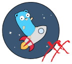
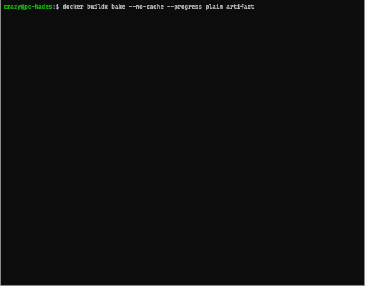

[](https://github.com/crazy-max/goreleaser-xx)

[](https://github.com/crazy-max/goreleaser-xx/releases/latest)
[](https://github.com/crazy-max/goreleaser-xx/actions?query=workflow%3Abuild)
[](https://hub.docker.com/r/crazymax/goreleaser-xx/)
[](https://hub.docker.com/r/crazymax/goreleaser-xx/)
[](https://goreportcard.com/report/github.com/crazy-max/goreleaser-xx)

## About

`goreleaser-xx` is a small wrapper around the fantastic [GoReleaser](https://github.com/goreleaser/goreleaser) build
tool to be able to handle a functional [multi-platform scratch Docker image](https://hub.docker.com/r/crazymax/goreleaser-xx/tags?page=1&ordering=last_updated)
to ease the integration and cross compilation in a Dockerfile for your Go projects.


> Building [yasu](https://github.com/crazy-max/yasu) with `goreleaser-xx`

___

* [Features](#features)
* [Image](#image)
* [CLI](#cli)
* [Usage](#usage)
  * [Minimal](#minimal)
  * [Multi-platform image](#multi-platform-image)
* [Build](#build)
* [Contributing](#contributing)
* [License](#license)

## Features

* Handle `--platform` in your Dockerfile for multi-platform support
* Build into any architecture
* Translation of [platform ARGs in the global scope](https://docs.docker.com/engine/reference/builder/#automatic-platform-args-in-the-global-scope) into Go compiler's target
* Auto generation of `.goreleaser.yml` config based on target architecture

## Image

| Registry                                                                                                  | Image                                |
|-----------------------------------------------------------------------------------------------------------|--------------------------------------|
| [Docker Hub](https://hub.docker.com/r/crazymax/goreleaser-xx/)                                            | `crazymax/goreleaser-xx`             |
| [GitHub Container Registry](https://github.com/users/crazy-max/packages/container/package/goreleaser-xx)  | `ghcr.io/crazy-max/goreleaser-xx`    |

## CLI

`goreleaser-xx` handles basic [GoReleaser customizations](https://goreleaser.com/customization/) to be able
to generate a minimal `.goreleaser.yml` configuration.

```shell
docker run --rm -t crazymax/goreleaser-xx:latest goreleaser-xx --help
```

| Flag              | Env var                   | Description   |
|-------------------|---------------------------|---------------|
| `--debug`         | `DEBUG`                   | Enable debug (default `false`) |
| `--git-ref`       | `GIT_REF`                 | The branch or tag like `refs/tags/v1.0.0` (default to your working tree info) |
| `--goreleaser`    | `GORELEASER_PATH`         | Path to GoReleaser binary (default `/opt/goreleaser-xx/goreleaser`) |
| `--name`          | `GORELEASER_NAME`         | Project name |
| `--dist`          | `GORELEASER_DIST`         | Dist folder where artifact will be stored |
| `--artifact-type` | `GORELEASER_ARTIFACTTYPE` | Which type of artifact to create. Can be `archive` or `bin`. (default `archive`) |
| `--hooks`         | `GORELEASER_HOOKS`        | [Hooks](https://goreleaser.com/customization/hooks/) which will be executed before the build is started |
| `--main`          | `GORELEASER_MAIN`         | Path to main.go file or main package (default `.`) |
| `--ldflags`       | `GORELEASER_LDFLAGS`      | Custom ldflags templates |
| `--files`         | `GORELEASER_FILES`        | Additional files/template/globs you want to add to the [archive](https://goreleaser.com/customization/archive/) |
| `--replacements`  | `GORELEASER_REPLACEMENTS` | Replacements for `GOOS` and `GOARCH` in the archive/binary name. |
| `--envs`          | `GORELEASER_ENVS`         | Custom environment variables to be set during the build |
| `--snapshot`      | `GORELEASER_SNAPSHOT`     | Run in [snapshot](https://goreleaser.com/customization/snapshots/) mode |
| `--checksum`      | `GORELEASER_CHECKSUM`     | Create checksum (default `true`) |

## Usage

### Minimal

In the following example we are going to build a simple Go application against `linux/amd64`, `linux/arm64`,
`linux/arm/v7`, `windows/amd64` and `darwin/amd64` platforms using `goreleaser-xx` and
[buildx](https://github.com/docker/buildx).

```Dockerfile
# syntax=docker/dockerfile:1.2

FROM --platform=$BUILDPLATFORM crazymax/goreleaser-xx:latest AS goreleaser-xx
FROM --platform=$BUILDPLATFORM golang:alpine AS base
COPY --from=goreleaser-xx / /
RUN apk add --no-cache git
WORKDIR /src

FROM base AS build
ARG TARGETPLATFORM
RUN --mount=type=bind,source=.,target=/src,rw \
  --mount=type=cache,target=/root/.cache/go-build \
  --mount=type=cache,target=/go/pkg/mod \
  goreleaser-xx --debug \
    --name="myapp" \
    --dist="/out" \
    --hooks="go mod tidy" \
    --hooks="go mod download" \
    --ldflags="-s -w -X 'main.version={{.Version}}'" \
    --files="LICENSE" \
    --files="README.md" \
    --replacements="386=i386" \
    --replacements="amd64=x86_64" \
    --envs="FOO=bar" \
    --envs="BAR=foo"

FROM scratch AS artifact
COPY --from=build /out /
```

Now let's build with buildx:

```shell
docker buildx build \
  --platform "linux/amd64,linux/arm64,linux/arm/v7,windows/amd64,darwin/amd64" \
  --output "type=local,dest=./dist" \
  --target "artifact" \
  --file "./Dockerfile" .
```

Archives created by GoReleaser will be available in `./dist`:

```text
./dist
├── darwin_amd64
│ ├── myapp_v1.0.0-SNAPSHOT-00655a9_darwin_x86_64.tar.gz
│ └── myapp_v1.0.0-SNAPSHOT-00655a9_darwin_x86_64.tar.gz.sha256
├── linux_amd64
│ ├── myapp_v1.0.0-SNAPSHOT-00655a9_linux_x86_64.tar.gz
│ └── myapp_v1.0.0-SNAPSHOT-00655a9_linux_x86_64.tar.gz.sha256
├── linux_arm64
│ ├── myapp_v1.0.0-SNAPSHOT-00655a9_linux_arm64.tar.gz
│ └── myapp_v1.0.0-SNAPSHOT-00655a9_linux_arm64.tar.gz.sha256
├── linux_arm_v7
│ ├── myapp_v1.0.0-SNAPSHOT-00655a9_linux_armv7.tar.gz
│ └── myapp_v1.0.0-SNAPSHOT-00655a9_linux_armv7.tar.gz.sha256
└── windows_amd64
│ ├── myapp_v1.0.0-SNAPSHOT-00655a9_windows_x86_64.tar.gz
│ └── myapp_v1.0.0-SNAPSHOT-00655a9_windows_x86_64.tar.gz.sha256
```

### Multi-platform image

We can enhance the previous example to also create a multi-platform image in addition to the generated artifacts:

```Dockerfile
# syntax=docker/dockerfile:1.2

FROM --platform=$BUILDPLATFORM crazymax/goreleaser-xx:latest AS goreleaser-xx
FROM --platform=$BUILDPLATFORM golang:alpine AS base
COPY --from=goreleaser-xx / /
RUN apk add --no-cache git
WORKDIR /src

FROM base AS build
ARG TARGETPLATFORM
RUN --mount=type=bind,source=.,target=/src,rw \
  --mount=type=cache,target=/root/.cache/go-build \
  --mount=type=cache,target=/go/pkg/mod \
  goreleaser-xx --debug \
    --name="myapp" \
    --dist="/out" \
    --hooks="go mod tidy" \
    --hooks="go mod download" \
    --ldflags="-s -w -X 'main.version={{.Version}}'" \
    --files="LICENSE" \
    --files="README.md"

FROM scratch AS artifact
COPY --from=build /out /

FROM alpine:3.13 AS image
RUN apk --update --no-cache add ca-certificates libressl shadow \
  && addgroup -g 1000 myapp \
  && adduser -u 1000 -G myapp -s /sbin/nologin -D myapp
COPY --from=build /usr/local/bin/myapp /usr/local/bin/myapp
USER myapp
EXPOSE 8080
ENTRYPOINT [ "myapp" ]
```

As you can see, we have added a new stage called `image`. The artifact of each platform is available with
`goreleaser-xx` in `/usr/local/bin/{name}` (`build` stage) and will be retrieved and included in your `image` stage
through `COPY --from=build` instruction.

Now let's build, tag and push our multi-platform image in our favorite registry with buildx:

```shell
docker buildx build \
  --tag "user/myapp:latest" \
  --platform "linux/amd64,linux/arm64,linux/arm/v7" \
  --target "image" \
  --push \
  --file "./Dockerfile" .
```
> `windows/amd64` and `darwin/amd64` platforms have been removed here
> because `alpine:3.13` does not support them.

## Build

Everything is dockerized and handled by [buildx bake](docker-bake.hcl) for an agnostic usage of this repo:

```shell
git clone https://github.com/crazy-max/goreleaser-xx.git goreleaser-xx
cd goreleaser-xx

# test goreleaser-xx
docker buildx bake test

# build docker image and output to docker with goreleaser-xx:local tag (default)
docker buildx bake

# build multi-platform image
docker buildx bake image-all
```

## Contributing

Want to contribute? Awesome! The most basic way to show your support is to star :star2: the project,
or to raise issues :speech_balloon:. If you want to open a pull request, please read the
[contributing guidelines](.github/CONTRIBUTING.md).

You can also support this project by [**becoming a sponsor on GitHub**](https://github.com/sponsors/crazy-max) or by
making a [Paypal donation](https://www.paypal.me/crazyws) to ensure this journey continues indefinitely!

Thanks again for your support, it is much appreciated! :pray:

## License

MIT. See `LICENSE` for more details.
