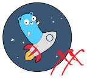

[](https://github.com/crazy-max/goreleaser-xx)

[](https://github.com/crazy-max/goreleaser-xx/releases/latest)
[](https://github.com/crazy-max/goreleaser-xx/actions?query=workflow%3Abuild)
[](https://hub.docker.com/r/crazymax/goreleaser-xx/)
[](https://hub.docker.com/r/crazymax/goreleaser-xx/)
[](https://goreportcard.com/report/github.com/crazy-max/goreleaser-xx)

## About

`goreleaser-xx` is a small wrapper around the fantastic [GoReleaser](https://github.com/goreleaser/goreleaser) build
tool to be able to handle a functional [multi-platform scratch Docker image](https://hub.docker.com/r/crazymax/goreleaser-xx/tags?page=1&ordering=last_updated)
to ease the integration and cross compilation in a Dockerfile for your Go projects.


> Building [yasu](https://github.com/crazy-max/yasu) with `goreleaser-xx`

___

* [Features](#features)
* [Image](#image)
* [CLI](#cli)
* [Usage](#usage)
* [Build](#build)
* [How can I help?](#how-can-i-help)
* [License](#license)

## Features

* Handle `--platform` in your Dockerfile for multi-platform support
* Build into any architecture
* Translation of [platform ARGs in the global scope](https://docs.docker.com/engine/reference/builder/#automatic-platform-args-in-the-global-scope) into Go compiler's target
* Auto generation of `.goreleaser.yml` config based on target architecture

## Image

| Registry                                                                                                  | Image                                |
|-----------------------------------------------------------------------------------------------------------|--------------------------------------|
| [Docker Hub](https://hub.docker.com/r/crazymax/goreleaser-xx/)                                            | `crazymax/goreleaser-xx`             |
| [GitHub Container Registry](https://github.com/users/crazy-max/packages/container/package/goreleaser-xx)  | `ghcr.io/crazy-max/goreleaser-xx`    |

## CLI

`goreleaser-xx` handles basic [GoReleaser customizations](https://goreleaser.com/customization/) to be able
to generate a minimal `.goreleaser.yml` configuration.

```shell
docker run --rm -t crazymax/goreleaser-xx:latest goreleaser-xx --help
```

| Flag              | Env var                   | Description   |
|-------------------|---------------------------|---------------|
| `--debug`         | `DEBUG`                   | Enable debug (default `false`) |
| `--git-ref`       | `GIT_REF`                 | The branch or tag like `refs/tags/v1.0.0` (default to your working tree info) |
| `--goreleaser`    | `GORELEASER_PATH`         | Path to GoReleaser binary (default `/opt/goreleaser-xx/goreleaser`) |
| `--name`          | `GORELEASER_NAME`         | Project name |
| `--dist`          | `GORELEASER_DIST`         | Dist folder where artifact will be stored |
| `--hooks`         | `GORELEASER_HOOKS`        | [Hooks](https://goreleaser.com/customization/hooks/) which will be executed before the build is started |
| `--main`          | `GORELEASER_MAIN`         | Path to main.go file or main package (default `.`) |
| `--ldflags`       | `GORELEASER_LDFLAGS`      | Custom ldflags templates |
| `--files`         | `GORELEASER_FILES`        | Additional files/template/globs you want to add to the [archive](https://goreleaser.com/customization/archive/) |

## Usage

```Dockerfile
# syntax=docker/dockerfile:1.2

FROM crazymax/goreleaser-xx:latest AS goreleaser-xx
FROM golang:alpine AS base
COPY --from=goreleaser-xx / /
WORKDIR /src

FROM base AS build
ARG TARGETPLATFORM
RUN --mount=type=bind,target=/src,rw \
  --mount=type=cache,target=/root/.cache/go-build \
  --mount=target=/go/pkg/mod,type=cache \
  goreleaser-xx --debug \
    --name="myapp" \
    --dist="/out" \
    --hooks="go mod tidy" \
    --hooks="go mod download" \
    --ldflags="-s -w -X 'main.version={{.Version}}'" \
    --files="LICENSE" \
    --files="README.md"

FROM scratch AS artifacts
COPY --from=build /out/*.tar.gz /
COPY --from=build /out/*.zip /
```

With the following buildx build command:

```shell
docker buildx build \
  --platform "linux/amd64,linux/arm64,linux/arm/v7,windows/amd64,darwin/amd64" \
  --output "type=local,dest=./dist" \
  --file "./Dockerfile" .
```

The following archives will be available in `./dist`:

```text
./dist
├── darwin_amd64
│ └── myapp_v1.0.0-SNAPSHOT-00655a9_darwin_x86_64.tar.gz
├── linux_amd64
│ └── myapp_v1.0.0-SNAPSHOT-00655a9_linux_x86_64.tar.gz
├── linux_arm64
│ └── myapp_v1.0.0-SNAPSHOT-00655a9_linux_arm64.tar.gz
├── linux_arm_v7
│ └── myapp_v1.0.0-SNAPSHOT-00655a9_linux_armv7.tar.gz
└── windows_amd64
  └── myapp_v1.0.0-SNAPSHOT-00655a9_windows_x86_64.zip
```

Here is an example of the generated `.goreleaser.yml` for `linux/arm/v7` platform:

```yaml
project_name: myapp
release:
  disable: true
builds:
- goos:
  - linux
  goarch:
  - arm
  goarm:
  - "7"
  gomips:
  - ""
  main: .
  ldflags:
  - -s -w -X 'main.version={{.Version}}'
  hooks:
    post:
    - cmd: cp "{{ .Path }}" /usr/local/bin/goreleaser
  env:
  - CGO_ENABLED=0
archives:
- replacements:
    "386": i386
    amd64: x86_64
  format_overrides:
  - goos: windows
    format: zip
  files:
  - LICENSE
  - README.md
  allow_different_binary_count: false
dist: /out
before:
  hooks:
  - go mod tidy
  - go mod download
```

## Build

Everything is dockerized and handled by [buildx bake](docker-bake.hcl) for an agnostic usage of this repo:

```shell
git clone https://github.com/crazy-max/goreleaser-xx.git goreleaser-xx
cd goreleaser-xx

# test goreleaser-xx
docker buildx bake test

# build docker image and output to docker with goreleaser-xx:local tag (default)
docker buildx bake

# build multi-platform image
docker buildx bake image-all
```

## How can I help?

All kinds of contributions are welcome :raised_hands:! The most basic way to show your support is to star :star2: the
project, or to raise issues :speech_balloon: You can also support this project by
[**becoming a sponsor on GitHub**](https://github.com/sponsors/crazy-max) :clap: or by making a
[Paypal donation](https://www.paypal.me/crazyws) to ensure this journey continues indefinitely! :rocket:

Thanks again for your support, it is much appreciated! :pray:

## License

MIT. See `LICENSE` for more details.
